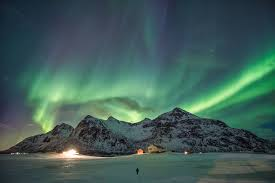

## Tarea Jimmy Calderón 
@JimJos-Calderon
# **Bosque boreal**

- **El fascinante mundo de las auroras polares**

1. Las auroras polares, conocidas como auroras boreales en el hemisferio norte y auroras australes en el hemisferio sur, son fenómenos luminosos que ocurren en las regiones cercanas a los polos magnéticos de la Tierra. 
2. Estas impresionantes luces en el cielo nocturno se deben a la interacción entre partículas cargadas del viento solar y los gases de la atmósfera terrestre, especialmente el oxígeno y el nitrógeno.
   
   

3. Al chocar con las moléculas de oxígeno y nitrógeno, estas partículas emiten luz de diferentes colores: 
   
   1. - [x] verde
   2. - [x] rosado</sapn>
   3. - [x] rojo
   4. - [x] violeta
   5. - [x] azul
  

>Cuando el viento solar, compuesto de protones y electrones, llega a la Tierra, es desviado por el campo magnético terrestre. Sin embargo, algunas partículas logran penetrar en las regiones polares, donde el campo magnético es más débil.
>>Además de su belleza, las auroras polares son objeto de estudio en física y astronomía, ya que aportan información valiosa sobre la actividad solar y el campo magnético terrestre. 

# Paises para poder observar

| País           | Regiones Populares                 | Época Recomendada                       | Características del Lugar                                                                                   |
|----------------|------------------------------------|-----------------------------------------|-------------------------------------------------------------------------------------------------------------|
| **Noruega**    | Tromsø, Islas Lofoten, Finnmark    | Septiembre a marzo                      | Cielos despejados y fácil acceso; Tromsø es conocida como la "capital de las auroras boreales".            |
| **Suecia**     | Abisko, Kiruna                     | Septiembre a marzo                      | Parque Nacional Abisko tiene un "efecto de agujero azul" que ofrece cielos despejados con frecuencia.       |
| **Finlandia**  | Laponia (Rovaniemi, Inari)         | Septiembre a abril                      | Inari y Rovaniemi ofrecen opciones de alojamiento en iglús de cristal para ver auroras desde el interior.  |
| **Islandia**   | Reikiavik, Akureyri                | Septiembre a marzo                      | Fácil acceso desde Reikiavik y paisajes volcánicos que crean escenarios únicos.                             |
| **Canadá**     | Yukón, Territorios del Noroeste    | Agosto a abril                          | Región poco poblada con cielos oscuros y paisajes montañosos ideales para ver auroras.                      |
| **Alaska (EE. UU.)** | Fairbanks, Parque Nacional Denali | Agosto a abril                      | Fairbanks es uno de los lugares más accesibles en EE. UU. para ver auroras boreales.                        |
| **Rusia**      | Múrmansk, Península de Kola        | Septiembre a marzo                      | La región de Múrmansk es famosa por sus largas noches y cielos despejados durante el invierno.              |

